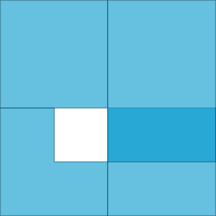
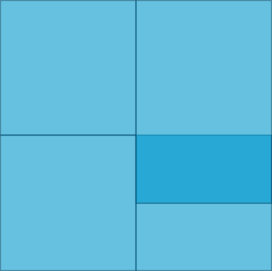

# maup

[](https://github.com/mggg/maup/actions/workflows/tests.yaml)
[](https://codecov.io/gh/mggg/maup)
[](https://pypi.org/project/maup/)
[](https://anaconda.org/conda-forge/maup)

`maup` is the geospatial toolkit for redistricting data. The package streamlines
the basic workflows that arise when working with blocks, precincts, and
districts, such as

-   [Assigning precincts to districts](#assigning-precincts-to-districts),
-   [Aggregating block data to precincts](#aggregating-block-data-to-precincts),
-   [Disaggregating data from precincts down to blocks](#disaggregating-data-from-precincts-down-to-blocks),
-   [Prorating data when units do not nest neatly](#prorating-data-when-units-do-not-nest-neatly),
    and
-   [Fixing topological issues, overlaps, and gaps](#fixing-topological-issues-overlaps-and-gaps)

The project's priorities are to be efficient by using spatial indices whenever
possible and to integrate well with the existing ecosystem around
[pandas](https://pandas.pydata.org/), [geopandas](https://geopandas.org) and
[shapely](https://shapely.readthedocs.io/en/latest/). The package is distributed
under the MIT License.

## Installation

We recommend installing `maup` from [conda-forge](https://conda-forge.org/)
using [conda](https://docs.conda.io/en/latest/):

```console
conda install -c conda-forge maup
```

You can get conda by installing
[Miniconda](https://docs.conda.io/en/latest/miniconda.html), a free Python
distribution made especially for data science and scientific computing. You
might also consider [Anaconda](https://www.anaconda.com/distribution/), which
includes many data science packages that you might find useful.

To install `maup` from PyPI, run `pip install maup` from your terminal.

## Examples

Here are some basic situations where you might find `maup` helpful. For these
examples, we use test data from Providence, Rhode Island, which you can find in
our
[Rhode Island shapefiles repo](https://github.com/mggg-states/RI-shapefiles), or
in the `examples` folder of this repo.

```python
>>> import geopandas
>>> import pandas
>>>
>>> blocks = geopandas.read_file("zip://./examples/blocks.zip")
>>> precincts = geopandas.read_file("zip://./examples/precincts.zip")
>>> districts = geopandas.read_file("zip://./examples/districts.zip")

```

### Assigning precincts to districts

The `assign` function in `maup` takes two sets of geometries called `sources`
and `targets` and returns a pandas `Series`. The Series maps each geometry in
`sources` to the geometry in `targets` that covers it. (Here, geometry _A_
_covers_ geometry _B_ if every point of _A_ and its boundary lies in _B_ or its
boundary.) If a source geometry is not covered by one single target geometry, it
is assigned to the target geometry that covers the largest portion of its area.

```python
>>> import maup
>>>
>>> assignment = maup.assign(precincts, districts)
>>> # Add the assigned districts as a column of the `precincts` GeoDataFrame:
>>> precincts["DISTRICT"] = assignment
>>> assignment.head()
0     7
1     5
2    13
3     6
4     1
dtype: int64

```

As an aside, you can use that `assignment` object to create a
[gerrychain](https://gerrychain.readthedocs.io/en/latest/) `Partition`
representing this districting plan.

### Aggregating block data to precincts

Precinct shapefiles usually come with election data, but not demographic data.
In order to study their demographics, we need to aggregate demographic data from
census blocks up to the precinct level. We can do this by assigning blocks to
precincts and then aggregating the data with a Pandas
[`groupby`](http://pandas.pydata.org/pandas-docs/stable/reference/api/pandas.DataFrame.groupby.html)
operation:

```python
>>> variables = ["TOTPOP", "NH_BLACK", "NH_WHITE"]
>>>
>>> assignment = maup.assign(blocks, precincts)
>>> precincts[variables] = blocks[variables].groupby(assignment).sum()
>>> precincts[variables].head()
   TOTPOP  NH_BLACK  NH_WHITE
0    5907       886       380
1    5636       924      1301
2    6549       584      4699
3    6009       435      1053
4    4962       156      3713

```

If you want to move data from one set of geometries to another but your source
and target geometries do not nest neatly (i.e. have overlaps), see
[Prorating data when units do not nest neatly](#prorating-data-when-units-do-not-nest-neatly).

### Disaggregating data from precincts down to blocks

It's common to have data at a coarser scale that you want to attach to
finer-scaled geometries. Usually this happens when vote totals for a certain
election are only reported at the county level, and we want to attach that data
to precinct geometries.

Let's say we want to prorate the vote totals in the columns `"PRES16D"`,
`"PRES16R"` from our `precincts` GeoDataFrame down to our `blocks` GeoDataFrame.
The first crucial step is to decide how we want to distribute a precinct's data
to the blocks within it. Since we're prorating election data, it makes sense to
use a block's total population or voting-age population. Here's how we might
prorate by population (`"TOTPOP"`):

```python
>>> election_columns = ["PRES16D", "PRES16R"]
>>> assignment = maup.assign(blocks, precincts)
>>>
>>> # We prorate the vote totals according to each block's share of the overall
>>> # precinct population:
>>> weights = blocks.TOTPOP / assignment.map(precincts.TOTPOP)
>>> prorated = maup.prorate(assignment, precincts[election_columns], weights)
>>>
>>> # Add the prorated vote totals as columns on the `blocks` GeoDataFrame:
>>> blocks[election_columns] = prorated
>>> # We'll call .round(2) to round the values for display purposes.
>>> blocks[election_columns].round(2).head()
   PRES16D  PRES16R
0     0.00     0.00
1    12.26     1.70
2    15.20     2.62
3    15.50     2.67
4     3.28     0.45

```

#### Warning about areal interpolation

**We strongly urge you _not_ to prorate by area!** The area of a census block is
**not** a good predictor of its population. In fact, the correlation goes in the
other direction: larger census blocks are _less_ populous than smaller ones.

### Prorating data when units do not nest neatly

Suppose you have a shapefile of precincts with some election results data and
you want to join that data onto a different, more recent precincts shapefile.
The two sets of precincts will have overlaps, and will not nest neatly like the
blocks and precincts did in the above examples. (Not that blocks and precincts
always nest neatly...)

We can use `maup.intersections` to break the two sets of precincts into pieces
that nest neatly into both sets. Then we can disaggregate from the old precincts
onto these pieces, and aggregate up from the pieces to the new precincts. This
move is a bit complicated, so `maup` provides a function called `prorate` that
does just that.

We'll use our same `blocks` GeoDataFrame to estimate the populations of the
pieces for the purposes of proration.

For our "new precincts" shapefile, we'll use the VTD shapefile for Rhode Island
that the U.S. Census Bureau produced as part of their 2018 test run of for the
2020 Census.

```python
>>> old_precincts = precincts
>>> new_precincts = geopandas.read_file("zip://./examples/new_precincts.zip")
>>>
>>> columns = ["SEN18D", "SEN18R"]
>>>
>>> # Include area_cutoff=0 to ignore any intersections with no area,
>>> # like boundary intersections, which we do not want to include in
>>> # our proration.
>>> pieces = maup.intersections(old_precincts, new_precincts, area_cutoff=0)
>>>
>>> # Weight by prorated population from blocks
>>> weights = blocks["TOTPOP"].groupby(maup.assign(blocks, pieces)).sum()
>>> # Normalize the weights so that votes are allocated according to their
>>> # share of population in the old_precincts
>>> weights = maup.normalize(weights, level=0)
>>>
>>> # Use blocks to estimate population of each piece
>>> new_precincts[columns] = maup.prorate(
...     pieces,
...     old_precincts[columns],
...     weights=weights
... )
>>> new_precincts[columns].head()
   SEN18D  SEN18R
0   752.0    51.0
1   370.0    21.0
2    97.0    17.0
3   585.0    74.0
4   246.0    20.0

```

### Progress bars

For long-running operations, the user might want to see a progress bar to
estimate how much longer a task will take (and whether to abandon it altogether).

`maup` provides an optional progress bar for this purpose. To temporarily activate
a progress bar for a certain operation, use `with maup.progress():`:

```python
>>> with maup.progress():
...     assignment = maup.assign(precincts, districts)
...

```

To turn on progress bars for all applicable operations (e.g. for an entire script),
set `maup.progress.enabled = True`:

```python
>>> maup.progress.enabled = True
>>> # Now a progress bar will display while this function runs:
>>> assignment = maup.assign(precincts, districts)
>>> # And this one too:
>>> pieces = maup.intersections(old_precincts, new_precincts, area_cutoff=0)

```
### Fixing topological issues, overlaps, and gaps

Precinct shapefiles are often created by stitching together collections of
precinct geometries sourced from different counties or different years. As a
result, the shapefile often has gaps or overlaps between precincts where the
different sources disagree about the boundaries. These gaps and overlaps pose
problems when you are interested in working with the adjacency graph of the
precincts, and not just in mapping the precincts. This adjacency information is
especially important when studying redistricting, because districts are almost
always expected to be contiguous.

`maup` provides functions for closing gaps and resolving overlaps in a
collection of geometries. As an example, we'll apply both functions to these
geometries, which have both an overlap and a gap:



Usually the gaps and overlaps in real shapefiles are tiny and easy to miss, but
this exaggerated example will help illustrate the functionality.

First, we'll use `shapely` to create the polygons from scratch:

```python
from shapely.geometry import Polygon
geometries = geopandas.GeoSeries([
    Polygon([(0, 0), (2, 0), (2, 1), (1, 1), (1, 2), (0, 2)]),
    Polygon([(2, 0), (4, 0), (4, 2), (2, 2)]),
    Polygon([(0, 2), (2, 2), (2, 4), (0, 4)]),
    Polygon([(2, 1), (4, 1), (4, 4), (2, 4)]),
])
```

Now we'll close the gap:

```python
without_gaps = maup.close_gaps(geometries)
```

The `without_gaps` geometries look like this:



And then resolve the overlaps:

```python
without_overlaps_or_gaps = maup.resolve_overlaps(without_gaps)
```

The `without_overlaps_or_gaps` geometries look like this:


Alternatively, there is also a convenience `maup.autorepair()` function provided that 
attempts to resolve topological issues as well as close gaps and resolve overlaps:

```python
without_overlaps_or_gaps = maup.autorepair(geometries)
```

The functions `resolve_overlaps`, `close_gaps`, and `autorepair` accept a
`relative_threshold` argument. This threshold controls how large of a gap or
overlap the function will attempt to fix. The default value of
`relative_threshold` is `0.1`, which means that the functions will leave alone
any gap/overlap whose area is more than 10% of the area of the geometries that
might absorb that gap/overlap. In the above example, we set
`relative_threshold=None` to ensure that no gaps or overlaps were ignored.

## Modifiable areal unit problem

The name of this package comes from the
[modifiable areal unit problem (MAUP)](https://en.wikipedia.org/wiki/Modifiable_areal_unit_problem):
the same spatial data will look different depending on how you divide up the
space. Since `maup` is all about changing the way your data is aggregated and
partitioned, we have named it after the MAUP to encourage users to use the
toolkit thoughtfully and responsibly.
