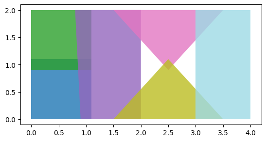
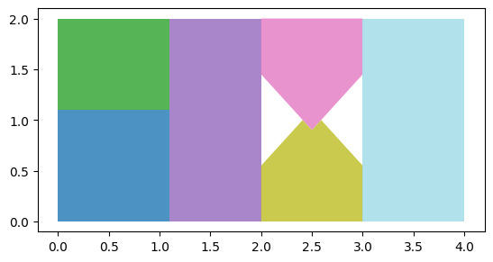
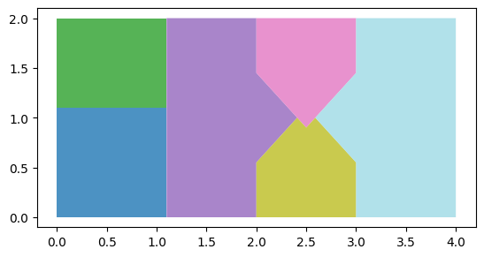
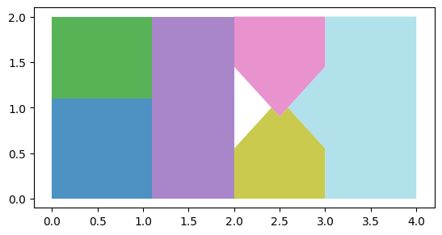
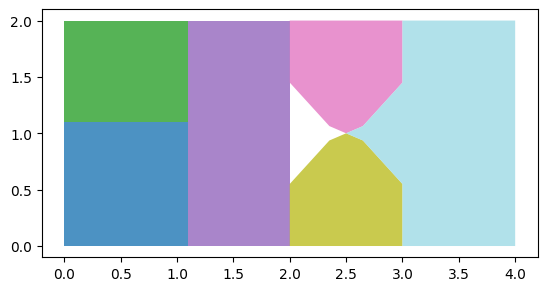

# maup

[](https://github.com/mggg/maup/actions/workflows/tests.yaml)
[](https://codecov.io/gh/mggg/maup)
[](https://pypi.org/project/maup/)
[](https://anaconda.org/conda-forge/maup)

`maup` is the geospatial toolkit for redistricting data. The package streamlines
the basic workflows that arise when working with blocks, precincts, and
districts, such as

-   [Assigning precincts to districts](#assigning-precincts-to-districts),
-   [Aggregating block data to precincts](#aggregating-block-data-to-precincts),
-   [Disaggregating data from precincts down to blocks](#disaggregating-data-from-precincts-down-to-blocks),
-   [Prorating data when units do not nest neatly](#prorating-data-when-units-do-not-nest-neatly),
    and
-   [Fixing topological issues, overlaps, and gaps](#fixing-topological-issues-overlaps-and-gaps)

The project's priorities are to be efficient by using spatial indices whenever
possible and to integrate well with the existing ecosystem around
[pandas](https://pandas.pydata.org/), [geopandas](https://geopandas.org) and
[shapely](https://shapely.readthedocs.io/en/latest/). The package is distributed
under the MIT License.

## Installation

To install `maup` from PyPI, run `pip install maup` from your terminal.

For development, `maup` uses [Poetry](https://python-poetry.org/docs/basic-usage/).
To develop new `maup` features, clone this repository and run `poetry install`.

## Examples

Here are some basic situations where you might find `maup` helpful. For these
examples, we use test data from Providence, Rhode Island, which you can find in
our
[Rhode Island shapefiles repo](https://github.com/mggg-states/RI-shapefiles), or
in the `examples` folder of this repo, reprojected to a non-geographic coordinate
reference system (CRS) optimized
for Rhode Island.

*Many of maup's functions behave badly in geographic projections (i.e., lat/long 
coordinates), which are the default for shapefiles from the U.S. Census bureau. In 
order to find an appropriate CRS for a particular shapefile, consult the database
at [https://epsg.org](https://epsg.org).*


```python
>>> import geopandas
>>> import pandas
>>>
>>> blocks = geopandas.read_file("zip://./examples/blocks.zip").to_crs(32030)
>>> precincts = geopandas.read_file("zip://./examples/precincts.zip").to_crs(32030)
>>> districts = geopandas.read_file("zip://./examples/districts.zip").to_crs(32030)

```

### Assigning precincts to districts

The `assign` function in `maup` takes two sets of geometries called `sources`
and `targets` and returns a pandas `Series`. The Series maps each geometry in
`sources` to the geometry in `targets` that covers it. (Here, geometry _A_
_covers_ geometry _B_ if every point of _A_ and its boundary lies in _B_ or its
boundary.) If a source geometry is not covered by one single target geometry, it
is assigned to the target geometry that covers the largest portion of its area.

```python
>>> import maup
>>>
>>> precincts_to_districts_assignment = maup.assign(precincts, districts)
>>> # Add the assigned districts as a column of the `precincts` GeoDataFrame:
>>> precincts["DISTRICT"] = precincts_to_districts_assignment
>>> precinct_to_district_assignment.head()
0     7
1     5
2    13
3     6
4     1

```

As an aside, you can use that `precincts_to_districts_assignment` object to create a
[gerrychain](https://gerrychain.readthedocs.io/en/latest/) `Partition`
representing this districting plan.

### Aggregating block data to precincts

Precinct shapefiles usually come with election data, but not demographic data.
In order to study their demographics, we need to aggregate demographic data from
census blocks up to the precinct level. We can do this by assigning blocks to
precincts and then aggregating the data with a Pandas
[`groupby`](http://pandas.pydata.org/pandas-docs/stable/reference/api/pandas.DataFrame.groupby.html)
operation:

```python
>>> variables = ["TOTPOP", "NH_BLACK", "NH_WHITE"]
>>>
>>> blocks_to_precincts_assignment = maup.assign(blocks, precincts)
>>> precincts[variables] = blocks[variables].groupby(blocks_to_precincts_assignment).sum()
>>> precincts[variables].head()
   TOTPOP  NH_BLACK  NH_WHITE
0    5907       886       380
1    5636       924      1301
2    6549       584      4699
3    6009       435      1053
4    4962       156      3713

```

If you want to move data from one set of geometries to another but your source
and target geometries do not nest neatly (e.g., have overlaps), see
[Prorating data when units do not nest neatly](#prorating-data-when-units-do-not-nest-neatly),
and also 
[Fixing topological issues, overlaps, and gaps](#fixing-topological-issues-overlaps-and-gaps).

### Disaggregating data from precincts down to blocks

It's common to have data at a coarser scale that you want to attach to
finer-scaled geometries. Usually this happens when vote totals for a certain
election are reported at the precinct level, and we want to attach that data
to Census block geometries.

Let's say we want to prorate the vote totals in the columns `"PRES16D"`,
`"PRES16R"` from our `precincts` shapefile down to our `blocks` shapefile.
The first crucial step is to decide how we want to distribute a precinct's data
to the blocks within it. Since we're prorating election data, it makes sense to
use a block's total population or voting-age population. Here's how we might
prorate by population (`"TOTPOP"`):

```python
>>> election_columns = ["PRES16D", "PRES16R"]
>>> blocks_to_precincts_assignment = maup.assign(blocks, precincts)
>>>
>>> # We prorate the vote totals according to each block's share of the overall
>>> # precinct population:
>>> weights = blocks.TOTPOP / blocks_to_precincts_assignment.map(blocks.TOTPOP.groupby(blocks_to_precincts_assignment).sum())
>>> prorated = maup.prorate(blocks_to_precincts_assignment, precincts[election_columns], weights)
>>>
>>> # Add the prorated vote totals as columns on the `blocks` GeoDataFrame:
>>> blocks[election_columns] = prorated
>>>
>>> # We'll call .round(2) to round the values for display purposes, but note that the 
>>> # actual values should NOT be rounded in order to avoid accumulation of rounding
>>> # errors.
>>> blocks[election_columns].round(2).head()
   PRES16D  PRES16R
0     0.00     0.00
1    12.26     1.70
2    15.20     2.62
3    15.50     2.67
4     3.28     0.45

```

#### Warning about areal interpolation

**We strongly urge you _not_ to prorate by area!** The area of a census block is
**not** a good predictor of its population. In fact, the correlation goes in the
other direction: larger census blocks are _less_ populous than smaller ones.

#### Warnings about data anomalies

(1) Many states contain Census blocks and precincts that have zero population. In the
example above, a zero-population precinct leads to division by zero in the 
definition of the weights, which results in NaN values for some entries.

Although it is not strictly necessary to resolve this in the example above, sometimes
this creates issues down the line.  One option is to replace NaN values with zeros, 
using

```python
>>> weights = weights.fillna(0)
```

(2) In some cases, zero-population precincts may have a small nonzero number of recorded
votes in some elections. The procedure outlined above will lose these votes in the 
proration process due to the zero (or NaN) values for the weights corresponding to all
the blocks in those precincts. If it is crucial to keep vote totals perfectly accurate, 
these votes will need to be assigned to the new units manually.

### Prorating data when units do not nest neatly

Suppose you have a shapefile of precincts with some election results data and
you want to join that data onto a different, more recent precincts shapefile.
The two sets of precincts will have overlaps, and will not nest neatly like the
blocks and precincts did in the above examples. (Not that blocks and precincts
always nest neatly---in fact, they usually don't!)

In most cases, election data should be prorated from each old precinct to the new
precincts with weights proportional to the population of the intersections between
the old precinct and each new precinct.  The most straightforward way to accomplish 
this is to first disaggregate the data from the old precincts to Census blocks as in 
the example above, and then reaggregate from blocks to the new precincts. 

```python
>>> old_precincts = precincts
>>> new_precincts = geopandas.read_file("zip://./examples/new_precincts.zip").to_crs(32030)
>>>
>>> election_columns = ["SEN18D", "SEN18R"]
>>>
>>> blocks_to_old_precincts_assignment = maup.assign(blocks, old_precincts)
>>> blocks_to_new_precincts_assignment = maup.assign(blocks, new_precincts)
>>>
>>> # We prorate the vote totals according to each block's share of the overall
>>> # old precinct population:
>>> weights = blocks.TOTPOP / blocks_to_old_precincts_assignment.map(blocks.TOTPOP.groupby(blocks_to_old_precincts_assignment).sum()).fillna(0)
>>> prorated = maup.prorate(blocks_to_old_precincts_assignment, precincts[election_columns], weights)
>>>
>>> # Add the prorated vote totals as columns on the `blocks` GeoDataFrame:
>>> blocks[election_columns] = prorated
>>>
>>> new_precincts[election_columns] = blocks[election_columns].groupby(blocks_to_new_precincts_assignment).sum()
>>> new_precincts[election_columns].round(2).head()

   SEN18D  SEN18R
0  728.17   49.38
1  370.00   21.00
2   97.00   17.00
3   91.16    5.55
4  246.00   20.00

```

As a sanity check, let's make sure that no votes were lost in either step.
Total votes in the old precincts:
```python
>>> old_precincts[election_columns].sum()
SEN18D    23401
SEN18R     3302

>>>
>>> blocks[election_columns].sum()
SEN18D    23401.0
SEN18R     3302.0

>>>
>>> new_precincts[election_columns].sum()
SEN18D    20565.656675
SEN18R     2947.046857
```

Oh no - what happened??? All votes were successfully disaggregated to blocks, but a
significant percentage were lost when reaggregating to new precincts.

It turns out that when blocks were assigned to both old and new precincts, many blocks
were not assigned to any precincts.  We can count how many blocks were unassigned in each
case:

```python
print(len(blocks))
print(blocks_to_old_precincts_assignment.isna().sum())
print(blocks_to_new_precincts_assignment.isna().sum())
3014
884
1227
```

So, out of 3,014 total Census blocks, 884 were not assigned to any old precinct and 
1,227 were not assigned to any new precinct.  If we plot the shapefiles, we can see why:
```python
>>> blocks.plot()
```


```python
>>> old_precincts.plot()
```


```python
>>> new_precincts.plot()
```


The boundaries of the regions covered by these shapefiles are substantially 
different---and that doesn't even get into the possibility that the precinct shapefiles
may have gaps between precinct polygons that some blocks may fall into.

Once we know to look for this issue, we can see that it affected the aggregation of
populations from blocks to precincts as well:

```python
>>> blocks[variables].sum()
TOTPOP      178040
NH_BLACK     23398
NH_WHITE     66909

>>>
>>> precincts[variables].sum()
TOTPOP      140332
NH_BLACK     19345
NH_WHITE     46667

```

#### Moral: Precinct shapefiles often have _terrible_ topological issues!
These issues should be diagnosed and repaired to the greatest extent possible before
moving data around between shapefiles; see
[Fixing topological issues, overlaps, and gaps](#fixing-topological-issues-overlaps-and-gaps)
below for details about how maup can help with this.


### Progress bars

For long-running operations, the user might want to see a progress bar to
estimate how much longer a task will take (and whether to abandon it altogether).

`maup` provides an optional progress bar for this purpose. To temporarily activate
a progress bar for a certain operation, use `with maup.progress():`:

```python
>>> with maup.progress():
...     assignment = maup.assign(precincts, districts)
...

```

To turn on progress bars for all applicable operations (e.g. for an entire script),
set `maup.progress.enabled = True`:

```python
>>> maup.progress.enabled = True
>>> # Now a progress bar will display while this function runs:
>>> assignment = maup.assign(precincts, districts)
>>> # And this one too:
>>> pieces = maup.intersections(old_precincts, new_precincts, area_cutoff=0)

```

### Fixing topological issues, overlaps, and gaps

Precinct shapefiles are often created by stitching together collections of
precinct geometries sourced from different counties or different years. As a
result, the shapefile often has gaps or overlaps between precincts where the
different sources disagree about the boundaries.  (And by "often," we mean "for almost
every shapefile that isn't produced by the U.S. Census Burueau.") As we saw in the 
examples above, these issues can pose problems when moving data between
shapefiles.

Even when working with a single shapefile, gaps and overlaps may cause problems if you 
are interested in working with the adjacency graph of the precincts. 
This adjacency information is especially important when studying redistricting, because 
districts are almost always expected to be contiguous.

Before doing anything else, it is wise to understand the current status of a shapefile
with regard to topological issues.  `maup` provides a `doctor` function to diagnose gaps,
overlaps, and invalid geometries.  If a shapefile has none of these issues, `maup.doctor` 
returns a value of `True`; otherwise it returns `False` along with a count of the 
problems that it found.

The blocks shapefile, like all shapefiles from the Census, is clean:
```python
>>> maup.doctor(blocks)
True
```

The old precincts shapefile, however, has some minor issues:
```python
>>> maup.doctor(old_precincts)
There are 2 overlaps.
There are 3 holes.
False
```

`maup` provides an `autorepair` function with a variety of options for fixing these issues.  

#### Update alert! 

The repair functionality has been completely redesigned for version 2.0, with major
improvements!  For backwards compatibility, the old versions of the functions 
`autorepair`, `close_gaps`, and `resolve_overlaps` have been renamed to
`maup.repair_old.autorepair_old`, `maup.repair_old.close_gaps_old`, and
`maup.repair_old.resolve_overlaps_old`, respectively---but you are strongly 
encouraged to use the updated functions.

The overlaps and gaps in the old_precincts file can be repaired as follows:

```python
>>> old_precincts_repaired = maup.autorepair(old_precincts)
Identifying overlaps...
Resolving overlaps...
Assigning order 2 pieces...
Closing gaps...
>>> maup.doctor(old_precincts_repaired)
True
```

Here's a more detailed look at what's going on under the hood for a simple example.
First, we'll use `shapely` to create the polygons from scratch:

```python
from shapely.geometry import Polygon
geometries = geopandas.GeoSeries([
    Polygon([(0,0), (1.1, 0), (1.1, 1.1), (0, 1.1)]),
    Polygon([(0, 0.9), (1.1, 0.9), (1.1, 2), (0, 2)]),
    Polygon([(0.9, 0), (2, 0), (2, 2), (0.8, 2)]),
    Polygon([(2.5, 0.9), (2.5, 2), (1.5, 2)]),
    Polygon([(2.5, 0), (2.5, 1.1), (1.5, 0)]),
    Polygon([(3,0), (4,0), (4,2), (3,2)]
])
geometries.plot(cmap = "tab20", alpha=0.8)
```



The first thing that the `autorepair` function does is to resolve overlaps. We can call the `autorepair` 
function with the option `fill_gaps = False` to just resolve the overlaps and leave the gaps alone:

```python
geometries_overlaps_fixed = maup.autorepair(geometries, fill_gaps=False)
geometries_overlaps_fixed.plot(cmap = "tab20", alpha=0.8)
```



Calling `autorepair` without this flag will both resolve the overlaps and fill the
gaps:


```python
geometries_fixed = maup.autorepair(geometries)
geometries_fixed.plot(cmap = "tab20", alpha=0.8)
```



One other issue is that imperfections in shapefiles may result in a repaired file that
has small rook-style adjacencies that should really be queen-style---e.g., where 4
polygons come together to form a corner.  This is not generally significant for moving
data around, but for purposes of forming contiguous districts from a shapefile it can
result in "contiguous" districts that are only connected along these "false" adjacencies.
The `autorepair` function has a `min_rook_length` option to specify a length threshold 
for which all rook adjacencies with length below the threshold will be converted to queen 
adjacencies. 
#### Be very careful to specify this threshold in terms of the shapefile's CRS units!

Here is the result of applying this option to our example:

```python
geometries_fixed_rook_to_queen = maup.autorepair(geometries, min_rook_length = 0.3)
geometries_fixed_rook_to_quee.plot(cmap = "tab20", alpha=0.8)
```


Finally, sometimes a shapefile may have some gaps that you don't want to fill (for example, a
large lake).  In that case, the `autorepair` has a `holes_to_keep` option to specify a
GeoSeries of holes that should not be filled in.
#### This GeoSeries must be in the same CRS as the input shapefile!

In this example, the original shapefile contains two holes.  Suppose we want to keep the 
one on the left, which is the following triangle (coordinates have been rounded to 2
decimal places):

```python
keep_this_hole = Polygon([(2.0, 1.45), (2.0, 0.55), (2.41, 1.0)])
```

Create a GeoSeries containing this hole, with no CRS needed since the main shapefile
doesn't have one:

```python
keep_this_hole_series = geopandas.GeoSeries([keep_this_hole])
```

Use the `holes_to_keep` option:
```python
geometries_fixed_with_hole = maup.autorepair(geometries, holes_to_keep = keep_this_hole_series)
geometries_fixed_with_hole.plot(cmap = "tab20", alpha=0.8)
```



These options can also be combined:

```python
geometries_fixed_with_hole_and_rook_to_queen = maup.autorepair(geometries, min_rook_length = 0.3, holes_to_keep = keep_this_hole_series)
geometries_fixed_with_hole_and_rook_to_queen.plot(cmap = "tab20", alpha=0.8)
```




