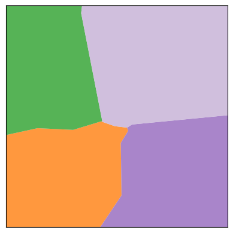

# maup

[](https://github.com/mggg/maup/actions/workflows/tests.yaml)
[](https://codecov.io/gh/mggg/maup)
[](https://pypi.org/project/maup/)

`maup` is the geospatial toolkit for redistricting data. The package streamlines
the basic workflows that arise when working with blocks, precincts, and
districts, such as

-   [Assigning precincts to districts](#assigning-precincts-to-districts),
-   [Aggregating block data to precincts](#aggregating-block-data-to-precincts),
-   [Disaggregating data from precincts down to blocks](#disaggregating-data-from-precincts-down-to-blocks),
-   [Prorating data when units do not nest neatly](#prorating-data-when-units-do-not-nest-neatly),
    and
-   [Fixing topological issues, overlaps, and gaps](#fixing-topological-issues-overlaps-and-gaps)

The project's priorities are to be efficient by using spatial indices whenever
possible and to integrate well with the existing ecosystem around
[pandas](https://pandas.pydata.org/), [geopandas](https://geopandas.org) and
[shapely](https://shapely.readthedocs.io/en/latest/). The package is distributed
under the MIT License.

## Installation

To install `maup` from PyPI, run `pip install maup` from your terminal.

For development, `maup` uses [Poetry](https://python-poetry.org/docs/basic-usage/).
To develop new `maup` features, clone this repository and run `poetry install`.

## Examples

Here are some basic situations where you might find `maup` helpful. For these
examples, we use test data from Providence, Rhode Island, which you can find in
our
[Rhode Island shapefiles repo](https://github.com/mggg-states/RI-shapefiles), or
in the `examples` folder of this repo, reprojected to a non-geographic coordinate
reference system (CRS) optimized
for Rhode Island.

** Many of maup's functions behave badly in geographic projections (i.e., lat/long 
coordinates), which are the default for shapefiles from the U.S. Census bureau. In 
order to find an appropriate CRS for a particular shapefile, consult the database
at [https://epsg.org](https://epsg.org). **


```python
>>> import geopandas
>>> import pandas
>>>
>>> blocks = geopandas.read_file("zip://./examples/blocks.zip").to_crs(32030)
>>> precincts = geopandas.read_file("zip://./examples/precincts.zip").to_crs(32030)
>>> districts = geopandas.read_file("zip://./examples/districts.zip").to_crs(32030)

```

## Assigning precincts to districts

The `assign` function in `maup` takes two sets of geometries called `sources`
and `targets` and returns a pandas `Series`. The Series maps each geometry in
`sources` to the geometry in `targets` that covers it. (Here, geometry _A_
_covers_ geometry _B_ if every point of _A_ and its boundary lies in _B_ or its
boundary.) If a source geometry is not covered by one single target geometry, it
is assigned to the target geometry that covers the largest portion of its area.

```python
>>> import maup
>>>
>>> precinct_to_district_assignment = maup.assign(precincts, districts)
>>> # Add the assigned districts as a column of the `precincts` GeoDataFrame:
>>> precincts["DISTRICT"] = precinct_to_district_assignment
>>> precinct_to_district_assignment.head()
0     7
1     5
2    13
3     6
4     1
dtype: int64

```

As an aside, you can use that `precinct_to_district_assignment` object to create a
[gerrychain](https://gerrychain.readthedocs.io/en/latest/) `Partition`
representing this districting plan.

## Aggregating block data to precincts

Precinct shapefiles usually come with election data, but not demographic data.
In order to study their demographics, we need to aggregate demographic data from
census blocks up to the precinct level. We can do this by assigning blocks to
precincts and then aggregating the data with a Pandas
[`groupby`](http://pandas.pydata.org/pandas-docs/stable/reference/api/pandas.DataFrame.groupby.html)
operation:

```python
>>> variables = ["TOTPOP", "NH_BLACK", "NH_WHITE"]
>>>
>>> blocks_to_precincts_assignment = maup.assign(blocks, precincts)
>>> precincts[variables] = blocks[variables].groupby(blocks_to_precincts_assignment).sum()
>>> precincts[variables].head()
   TOTPOP  NH_BLACK  NH_WHITE
0    5907       886       380
1    5636       924      1301
2    6549       584      4699
3    6009       435      1053
4    4962       156      3713

```

If you want to move data from one set of geometries to another but your source
geometries do not nest cleanly into your target geometries, see
[Prorating data when units do not nest neatly](#prorating-data-when-units-do-not-nest-neatly).

## Disaggregating data from precincts down to blocks

It's common to have data at a coarser scale that you want to attach to
finer-scale geometries. For instance, this may happen when vote totals for a certain election are only reported at the county level, and we want to attach that data to precinct geometries.

Let's say we want to prorate the vote totals in the columns `"PRES16D"`,
`"PRES16R"` from our `precincts` GeoDataFrame down to our `blocks` GeoDataFrame.
The first crucial step is to decide how we want to distribute a precinct's data
to the blocks within it. Since we're prorating election data, it makes sense to
use a block's total population or voting-age population. Here's how we might
prorate by population (`"TOTPOP"`):

```python
>>> election_columns = ["PRES16D", "PRES16R"]
>>> blocks_to_precincts_assignment = maup.assign(blocks, precincts)
>>>
>>> # We prorate the vote totals according to each block's share of the overall
>>> # precinct population:
>>> weights = blocks.TOTPOP / blocks_to_precincts_assignment.map(blocks.TOTPOP.groupby(blocks_to_precincts_assignment).sum())
>>> prorated = maup.prorate(blocks_to_precincts_assignment, precincts[election_columns], weights)
>>>
>>> # Add the prorated vote totals as columns on the `blocks` GeoDataFrame:
>>> blocks[election_columns] = prorated
>>>
>>> # We'll call .round(2) to round the values for display purposes, but note that the 
>>> # actual values should NOT be rounded in order to avoid accumulation of rounding
>>> # errors.
>>> blocks[election_columns].round(2).head()
   PRES16D  PRES16R
0     0.00     0.00
1    12.26     1.70
2    15.20     2.62
3    15.50     2.67
4     3.28     0.45

```

#### Warning about areal interpolation

**We strongly urge you _not_ to prorate by area!** The area of a census block is
**not** a good predictor of its population. In fact, the correlation goes in the
other direction: larger census blocks are _less_ populous than smaller ones.

#### Warnings about data anomalies

(1) Many states contain Census blocks and precincts that have zero population. In the
example above, a zero-population precinct leads to division by zero in the 
definition of the weights, which results in NaN values for some entries.

Although it is not strictly necessary to resolve this in the example above, sometimes
this creates issues down the line.  One option is to replace NaN values with zeros, 
using

```python
>>> weights = weights.fillna(0)
```

(2) In some cases, zero-population precincts may have a small nonzero number of recorded
votes in some elections. The procedure outlined above will lose these votes in the 
proration process due to the zero (or NaN) values for the weights corresponding to all
the blocks in those precincts. If it is crucial to keep vote totals perfectly accurate, 
these votes will need to be assigned to the new units manually.

## Prorating data when units do not nest neatly

Suppose you have a shapefile of precincts with some election results data and
you want to join that data onto a different, more recent precincts shapefile.
The two sets of precincts will have overlaps, and will not nest neatly like the
blocks and precincts did in the above examples. (Not that blocks and precincts
always nest neatly---in fact, they usually don't!)

In most cases, election data should be prorated from each old precinct to the new
precincts with weights proportional to the population of the intersections between
the old precinct and each new precinct.  The most straightforward way to accomplish 
this is to first disaggregate the data from the old precincts to Census blocks as in the example above, and then reaggregate from blocks to the new precincts. 

```python
>>> old_precincts = precincts
>>> new_precincts = geopandas.read_file("zip://./examples/new_precincts.zip").to_crs(32030)
>>>
>>> election_columns = ["SEN18D", "SEN18R"]
>>>
>>> blocks_to_old_precincts_assignment = maup.assign(blocks, old_precincts)
>>> blocks_to_new_precincts_assignment = maup.assign(blocks, new_precincts)
>>>
>>> # We prorate the vote totals according to each block's share of the overall
>>> # old precinct population:
>>> weights = blocks.TOTPOP / blocks_to_old_precincts_assignment.map(blocks.TOTPOP.groupby(blocks_to_old_precincts_assignment).sum()).fillna(0)
>>> prorated = maup.prorate(blocks_to_old_precincts_assignment, precincts[election_columns], weights)
>>>
>>> # Add the prorated vote totals as columns on the `blocks` GeoDataFrame:
>>> blocks[election_columns] = prorated
>>>
>>> new_precincts[election_columns] = blocks[election_columns].groupby(blocks_to_new_precincts_assignment).sum()
>>> new_precincts[election_columns].round(2).head()
    SEN18D   SEN18R
0   728.17    49.38
1	370.00	  21.00
2	 97.00	  17.00
3	 91.16	   5.55
4	246.00	  20.00
```

As a sanity check, let's make sure that no votes were lost in either step.
Total votes in the old precincts, blocks, and new precincts:
```python
>>> old_precincts[election_columns].sum()
SEN18D    23401
SEN18R     3302
dtype: float64
>>>
>>> blocks[election_columns].sum()
SEN18D    23401.0
SEN18R     3302.0
dtype: float64
>>>
>>> new_precincts[election_columns].sum()
SEN18D    20565.656675
SEN18R     2947.046857
dtype: float64
```

Oh no - what happened??? All votes were successfully disaggregated to blocks, but a
significant percentage were lost when reaggregating to new precincts.

It turns out that when blocks were assigned to both old and new precincts, many blocks were not assigned to any precincts.  We can count how many blocks were unassigned in each case:

```python
print(len(blocks))
print(blocks_to_old_precincts_assignment.isna().sum())
print(blocks_to_new_precincts_assignment.isna().sum())
3014
884
1227
```

So, out of 3,014 total Census blocks, 884 were not assigned to any old precinct and 
1,227 were not assigned to any new precinct.  If we plot the GeoDataFrames, we can see why:
```python
>>> blocks.plot()
```


```python
>>> old_precincts.plot()
```


```python
>>> new_precincts.plot()
```


The boundaries of the regions covered by these shapefiles are substantially 
different---and that doesn't even get into the possibility that the precinct shapefiles may have gaps between precinct polygons that some blocks may fall into.

Once we know to look for this issue, we can see that it affected the previous example 
as well:
```python
>>> blocks[variables].sum()
TOTPOP      178040
NH_BLACK     23398
NH_WHITE     66909
dtype: int64
>>>
>>> precincts[variables].sum()
TOTPOP      140332
NH_BLACK     19345
NH_WHITE     46667
dtype: int64
```

#### Moral: Precinct shapefiles often have _terrible_ topological issues!
These issues should be diagnosed and repaired to the greatest extent possible before
moving data around between shapefiles; see
[Fixing topological issues, overlaps, and gaps](#fixing-topological-issues-overlaps-and-gaps)
below for details about how maup can help with this.


## Progress bars

For long-running operations, the user might want to see a progress bar to
estimate how much longer a task will take (and whether to abandon it altogether).

`maup` provides an optional progress bar for this purpose. To temporarily activate
a progress bar for a certain operation, use `with maup.progress():`:

```python
>>> with maup.progress():
...     assignment = maup.assign(precincts, districts)
...

```

To turn on progress bars for all applicable operations (e.g. for an entire script),
set `maup.progress.enabled = True`:

```python
>>> maup.progress.enabled = True
>>> # Now a progress bar will display while this function runs:
>>> assignment = maup.assign(precincts, districts)
>>> # And this one too:
>>> pieces = maup.intersections(old_precincts, new_precincts, area_cutoff=0)

```

## Fixing topological issues, overlaps, and gaps

Precinct shapefiles are often created by stitching together collections of
precinct geometries sourced from different counties or different years. As a
result, the shapefile often has gaps or overlaps between precincts where the
different sources disagree about the boundaries.  (And by "often," we mean "for almost every shapefile that isn't produced by the U.S. Census Burueau.") 
As we saw in the examples above, these issues can pose problems when moving data between shapefiles.

Even when working with a single shapefile, gaps and overlaps may cause problems if you are interested in working with the adjacency graph of the precincts. 
This adjacency information is especially important when studying redistricting, because districts are almost always expected to be contiguous.

Before doing anything else, it is wise to understand the current status of a shapefile with regard to topological issues.  `maup` provides a `doctor` function to diagnose gaps, overlaps, and invalid geometries.  If a shapefile has none of these issues, `maup.doctor` returns a value of `True`; otherwise it returns `False` along with a brief summary of the problems that it found.

The blocks shapefile, like most shapefiles from the Census Bureau, is clean:
```python
>>> maup.doctor(blocks)
True
```

The old precincts shapefile, however, has some minor issues:
```python
>>> maup.doctor(old_precincts)
There are 2 overlaps.
There are 3 holes.
False
```

As of version 2.0.0, `maup` provides two repair functions with a variety of options for fixing these issues:  

1. `quick_repair` is the new name for the `autorepair` function from version 1.x (and `autorepair` still works as a synonym).  This function makes fairly simplistic repairs to gaps and overlaps:
    * Any polygon $Q$ created by the overlapping intersection of two geometries $P_1$ and $P_2$ is removed from both polygons and reassigned to the one with which it shares the greatest perimeter.
    * Any polygon $Q$ representing a gap between geometries $P_1,\ldots, P_n$ is assigned to the one with which it shares the greatest perimeter.

    This function is probably sufficient when gaps and overlaps are all very small in area relative to the areas of the geometries, **AND** when the repaired file will only be used for operations like aggregating and prorating data.  But it should **NOT** be relied upon when it is important for the repaired file to accurately represent adjacency relations between neighboring geometries, such as when a precinct shapefile is used as a basis for creating districting plans with contiguous districts.  
  
    For instance, when a gap adjoins many geometries (which happens frequently along county boundaries in precinct shapefiles!), whichever geometry the gap is adjoined to becomes "adjacent" to **all** the other geometries adjoining the gap, which can lead to the creation of discontiguous districts in plans based on the repaired shapefile. 

2. `smart_repair` is a more sophisticated repair function designed to reproduce the "true" adjacency relations between geometries as accurately as possible.  In the case of gaps that adjoin several geometries, this is accomplished by an algorithm that divides the gap into pieces to be assigned to different geometries instead of assigning the entire gap to a single geometry.  

   In addition to repairing gaps and overlaps, `smart_repair` includes two optional features:
    * In many cases, the shapefile geometries are intended to nest cleanly into some larger units; e.g., in many states, precincts should nest cleanly into counties.  `smart_repair` allows the user to optionally specify a second shapefile---e.g., a shapefile of county boundaries within a state---and then performs the repair process so that the repaired geometries nest cleanly into the units in the second shapefile.
    * Whether as a result of inaccurate boundaries in the original map or as an artifact of the repair algorithm, it may happen that some units share boundaries with very short perimeter but should actually be considered "queen adjacent"---i.e., intersecting at only a single point---rather than "rook adjacent"---i.e., intersecting along a boundary of positive length.  `smart_repair` includes an optional step in which all rook adjacencies of length below a user-specified parameter are converted to queen adjacencies.

`smart_repair` can accept either a GeoSeries or GeoDataFrame as input, and the output type will be the same as the input type.  The input must be projected to a non-geographic coordinate reference system (CRS)---i.e., **not** lat/long coordinates---in order to have sufficient precision for the repair.  One option is to reproject a GeoDataFrame called `gdf` to a suitable UTM (Universal Transverse Mercator) projection via
    
```python
gdf = gdf.to_crs(gdf.estimate_utm_crs())
```


At a minimum, all overlaps will be repaired in the output. Optional arguments include:
  * `snapped` (default value `True`): If `True`, all polygon vertices are snapped to a grid of size no more than $10^{-10}$ times the maximum of width/height of the entire shapefile extent. **HIGHLY RECOMMENDED**  to avoid topological exceptions due to rounding errors.
  * `fill_gaps` (default value `True`): If `True`, all simply connected gaps with area less than `fill_gaps_threshold` times the largest area of all geometries adjoining the gap are filled.  Default threshold is $0.1$; setting `fill_gaps_threshold = None` will fill all simply connected gaps.
  * `nest_within_regions` (default value `None`): If `nest_within_regions` is a secondary GeoSeries or GeoDataFrame of region boundaries (e.g., counties within a state) then the repair will be performed so that repaired geometries nest cleanly into the region boundaries; specifically, each repaired geometry will be contained in the region with which the original geometry has the largest area of intersection.  Note that the CRS for the region GeoSeries/GeoDataFrame must be the same as that for the primary input.
  * `min_rook_length` (default value `None`): If `min_rook_length` is given a numerical value, all rook adjacencies with length below this value will be replaced with queen adjacencies.  Note that this is an absolute value and not a relative value, so make sure that the value provided is in the correct units with respect to the input GeoSeries/GeoDataFrame's CRS.
        

### Examples

#### First, we'll use `shapely` and `geopandas` to create a GeoDataFrame of "toy precincts" from scratch. 

```python
import random
import geopandas
import maup
from shapely.geometry import Polygon

random.seed(2023) # For reproducibility

ppolys = []
for i in range(4):
    for j in range(4):
        poly = Polygon(
            [(0.5*i + 0.1*k, 0.5*j + (random.random() - 0.5)/12) for k in range(6)] +
            [(0.5*(i+1) + (random.random() - 0.5)/12, 0.5*j + 0.1*k) for k in range(1,6)] +
            [(0.5*(i+1) - 0.1*k, 0.5*(j+1) + (random.random() - 0.5)/12) for k in range(1,6)] +
            [(0.5*i + (random.random() - 0.5)/12, 0.5*(j+1) - 0.1*k) for k in range(1,5)]
        )
        ppolys.append(poly)
        
toy_precincts_df = geopandas.GeoDataFrame(geometry = geopandas.GeoSeries(ppolys))
toy_precincts_df.plot(cmap = "tab20", alpha=0.7)
```


Check for gaps and overlaps:
```python
>>> maup.doctor(old_precincts)
There are 28 overlaps.
There are 23 holes.
False
```
All the gaps between geometries in this example are below the default threshold, so a basic application of `smart_repair` will resolve all overlaps and fill all gaps:

```python
toy_precincts_repaired_df = maup.smart_repair(toy_precincts_df)
toy_precincts_repaired_df.plot(cmap = "tab20", alpha=0.7)
```


We can check that the repair succeeded:
```python
>>> maup.doctor(old_precincts)
True
```

Now suppose that the precincts are intended to nest cleanly into the following "toy counties:"

```python
cpoly1 = Polygon([(0,0), (1,0), (1,1), (0,1)])
cpoly2 = Polygon([(1,0), (2,0), (2,1), (1,1)])
cpoly3 = Polygon([(0,1), (1,1), (1,2), (0,2)])
cpoly4 = Polygon([(1,1), (2,1), (2,2), (1,2)])

toy_counties_df = geopandas.GeoDataFrame(geometry = geopandas.GeoSeries([cpoly1, cpoly2, cpoly3, cpoly4]))

toy_counties_df.plot(cmap='tab20')
```


We can perform a "county-aware" repair as follows:
```python
toy_precincts_repaired_county_aware_df = maup.smart_repair(toy_precincts_df, nest_within_regions = toy_counties_df)
toy_precincts_repaired_county_aware_df.plot(cmap = "tab20", alpha=0.7)
```


Next, suppose that we'd like to get rid of small rook adjacencies at corner points where 4 precincts meet.  We might reasonably estimate that these all have length less than $0.1$, so we can accomplish this as follows:
```python
toy_precincts_repaired_county_aware_rook_to_queen_df = maup.smart_repair(toy_precincts_df, nest_within_regions = toy_counties_df, min_rook_length = 0.1)
toy_precincts_repaired_county_aware_rook_to_queen_df.plot(cmap = "tab20", alpha=0.7)
```


The difference is hard to see, so let's zoom in on gap between the 4 original precincts in the upper left-hand corner.

Original precincts:


County-aware repair:



County-aware repair with rook adjacency converted to queen:


## Modifiable areal unit problem

The name of this package comes from the
[modifiable areal unit problem (MAUP)](https://en.wikipedia.org/wiki/Modifiable_areal_unit_problem):
the same spatial data will look different depending on how you divide up the
space. Since `maup` is all about changing the way your data is aggregated and
partitioned, we have named it after the MAUP to encourage users to use the
toolkit thoughtfully and responsibly.


