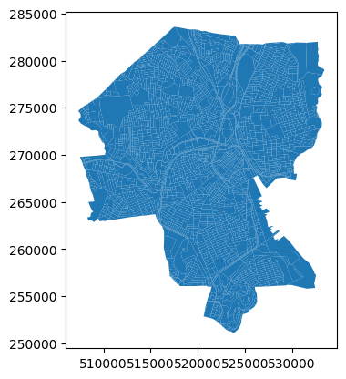
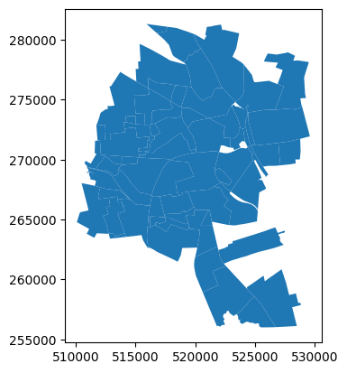
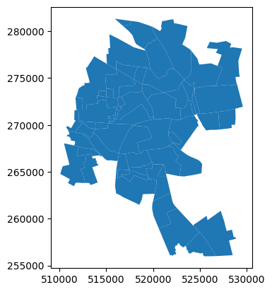

Prorating data when units do not nest neatly
============================================

.. warning::

   **We strongly urge you not to prorate by area!** The area of a census
   block is **not** a good predictor of its population. In fact, the
   correlation goes in the other direction: larger census blocks are *less*
   populous than smaller ones.

Suppose you have a shapefile of precincts with some election results
data and you want to join that data onto a different, more recent
precincts shapefile. The two sets of precincts will have overlaps, and
will not nest neatly like the blocks and precincts did in the above
examples. (Not that blocks and precincts always nest neatly—in fact,
they usually don't!)

In most cases, election data should be prorated from each old precinct
to the new precincts with weights proportional to the population of the
intersections between the old precinct and each new precinct. The most
straightforward way to accomplish this is to first disaggregate the data
from the old precincts to Census blocks as in the example above, and
then reaggregate from blocks to the new precincts.

.. code:: python

   >>> old_precincts = precincts
   >>> new_precincts = geopandas.read_file("zip://./examples/new_precincts.zip").to_crs(32030)
   >>>
   >>> election_columns = ["SEN18D", "SEN18R"]
   >>>
   >>> blocks_to_old_precincts_assignment = maup.assign(blocks, old_precincts)
   >>> blocks_to_new_precincts_assignment = maup.assign(blocks, new_precincts)
   >>>
   >>> # We prorate the vote totals according to each block's share of the overall
   >>> # old precinct population:
   >>> weights = blocks.TOTPOP / blocks_to_old_precincts_assignment.map(blocks.TOTPOP.groupby(blocks_to_old_precincts_assignment).sum()).fillna(0)
   >>> prorated = maup.prorate(blocks_to_old_precincts_assignment, precincts[election_columns], weights)
   >>>
   >>> # Add the prorated vote totals as columns on the `blocks` GeoDataFrame:
   >>> blocks[election_columns] = prorated
   >>>
   >>> new_precincts[election_columns] = blocks[election_columns].groupby(blocks_to_new_precincts_assignment).sum()
   >>> new_precincts[election_columns].round(2).head()
       SEN18D   SEN18R
   0   728.17    49.38
   1   370.00    21.00
   2    97.00    17.00
   3    91.16     5.55
   4   246.00    20.00

As a sanity check, let's make sure that no votes were lost in either
step. Total votes in the old precincts, blocks, and new precincts:

.. code:: python

   >>> old_precincts[election_columns].sum()
   SEN18D    23401
   SEN18R     3302
   dtype: float64
   >>>
   >>> blocks[election_columns].sum()
   SEN18D    23401.0
   SEN18R     3302.0
   dtype: float64
   >>>
   >>> new_precincts[election_columns].sum()
   SEN18D    20565.656675
   SEN18R     2947.046857
   dtype: float64

Oh no - what happened??? All votes were successfully disaggregated to
blocks, but a significant percentage were lost when reaggregating to new
precincts.

It turns out that when blocks were assigned to both old and new
precincts, many blocks were not assigned to any precincts. We can count
how many blocks were unassigned in each case:

.. code:: python

   print(len(blocks))
   print(blocks_to_old_precincts_assignment.isna().sum())
   print(blocks_to_new_precincts_assignment.isna().sum())
   3014
   884
   1227

So, out of 3,014 total Census blocks, 884 were not assigned to any old
precinct and 1,227 were not assigned to any new precinct. If we plot the
GeoDataFrames, we can see why:

.. code:: python

   >>> blocks.plot()

.. code:: python

   >>> old_precincts.plot()

.. code:: python

   >>> new_precincts.plot()

The boundaries of the regions covered by these shapefiles are
substantially different—and that doesn't even get into the possibility
that the precinct shapefiles may have gaps between precinct polygons
that some blocks may fall into.

Once we know to look for this issue, we can see that it affected the
previous example as well:

.. code:: python

   >>> blocks[variables].sum()
   TOTPOP      178040
   NH_BLACK     23398
   NH_WHITE     66909
   dtype: int64
   >>>
   >>> precincts[variables].sum()
   TOTPOP      140332
   NH_BLACK     19345
   NH_WHITE     46667
   dtype: int64

.. admonition:: Moral: Precinct shapefiles often have *terrible* topological issues!
    :class: tip

    These issues should be diagnosed and repaired to the greatest extent
    possible before moving data around between shapefiles; see `Fixing
    topological issues, overlaps, and
    gaps <#fixing-topological-issues-overlaps-and-gaps>`__ below for details
    about how maup can help with this.
