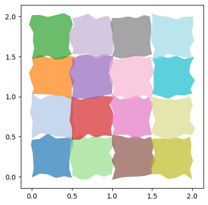
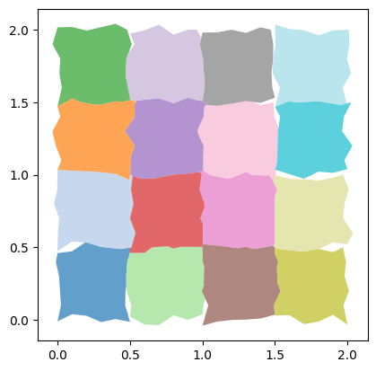
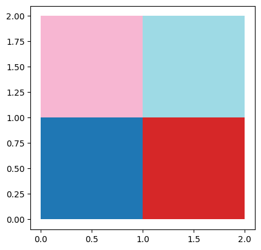
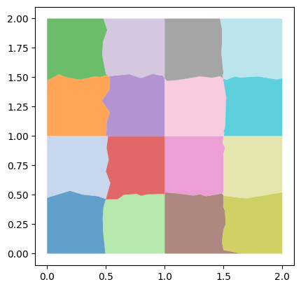
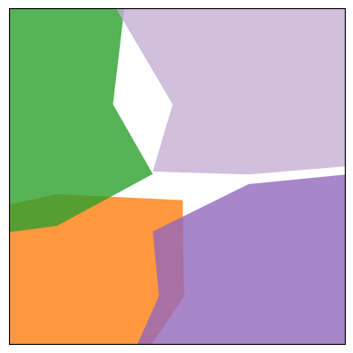
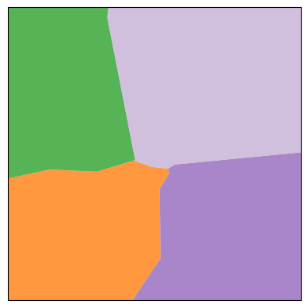
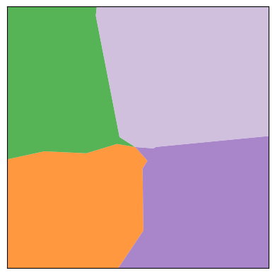

.. _examples-1:

Example
~~~~~~~

First, we'll use ``shapely`` and ``geopandas`` to create a GeoDataFrame of “toy precincts” from scratch.

.. code:: python

   import random
   import geopandas
   import maup
   from shapely.geometry import Polygon

   random.seed(2023) # For reproducibility

   ppolys = []
   for i in range(4):
       for j in range(4):
           poly = Polygon(
               [(0.5*i + 0.1*k, 0.5*j + (random.random() - 0.5)/12) for k in range(6)] +
               [(0.5*(i+1) + (random.random() - 0.5)/12, 0.5*j + 0.1*k) for k in range(1,6)] +
               [(0.5*(i+1) - 0.1*k, 0.5*(j+1) + (random.random() - 0.5)/12) for k in range(1,6)] +
               [(0.5*i + (random.random() - 0.5)/12, 0.5*(j+1) - 0.1*k) for k in range(1,5)]
           )
           ppolys.append(poly)
           
   toy_precincts_df = geopandas.GeoDataFrame(geometry = geopandas.GeoSeries(ppolys))
   toy_precincts_df.plot(cmap = "tab20", alpha=0.7)

Check for gaps and overlaps:

.. code:: python

   >>> maup.doctor(old_precincts)
   There are 28 overlaps.
   There are 23 holes.
   False

All the gaps between geometries in this example are below the default
threshold, so a basic application of ``smart_repair`` will resolve all
overlaps and fill all gaps:

.. code:: python

   toy_precincts_repaired_df = maup.smart_repair(toy_precincts_df)
   toy_precincts_repaired_df.plot(cmap = "tab20", alpha=0.7)

We can check that the repair succeeded:

.. code:: python

   >>> maup.doctor(old_precincts)
   True

Now suppose that the precincts are intended to nest cleanly into the
following “toy counties:”

.. code:: python

   cpoly1 = Polygon([(0,0), (1,0), (1,1), (0,1)])
   cpoly2 = Polygon([(1,0), (2,0), (2,1), (1,1)])
   cpoly3 = Polygon([(0,1), (1,1), (1,2), (0,2)])
   cpoly4 = Polygon([(1,1), (2,1), (2,2), (1,2)])

   toy_counties_df = geopandas.GeoDataFrame(geometry = geopandas.GeoSeries([cpoly1, cpoly2, cpoly3, cpoly4]))

   toy_counties_df.plot(cmap='tab20')

We can perform a “county-aware” repair as follows:

.. code:: python

   toy_precincts_repaired_county_aware_df = maup.smart_repair(toy_precincts_df, nest_within_regions = toy_counties_df)
   toy_precincts_repaired_county_aware_df.plot(cmap = "tab20", alpha=0.7)

Next, suppose that we'd like to get rid of small rook adjacencies at
corner points where 4 precincts meet. We might reasonably estimate that
these all have length less than :math:`0.1`, so we can accomplish this
as follows:

.. code:: python

   toy_precincts_repaired_county_aware_rook_to_queen_df = maup.smart_repair(toy_precincts_df, nest_within_regions = toy_counties_df, min_rook_length = 0.1)
   toy_precincts_repaired_county_aware_rook_to_queen_df.plot(cmap = "tab20", alpha=0.7)

The difference is hard to see, so let's zoom in on gap between the 4
original precincts in the upper left-hand corner.

Original precincts:

County-aware repair:

County-aware repair with rook adjacency converted to queen:

