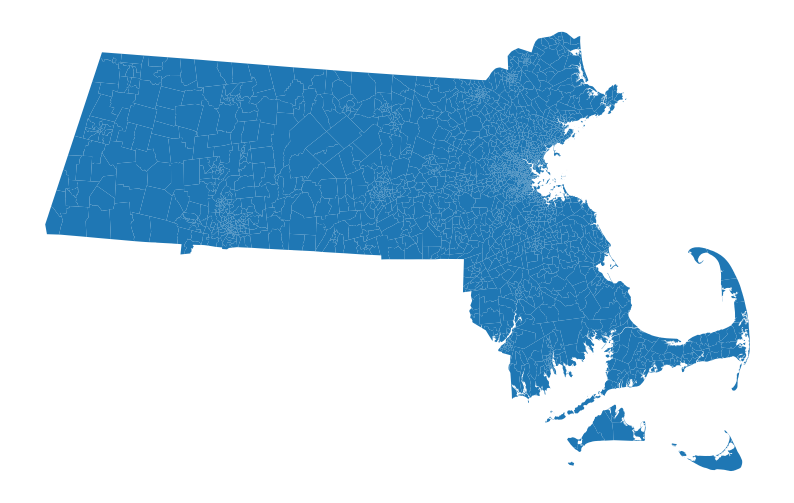
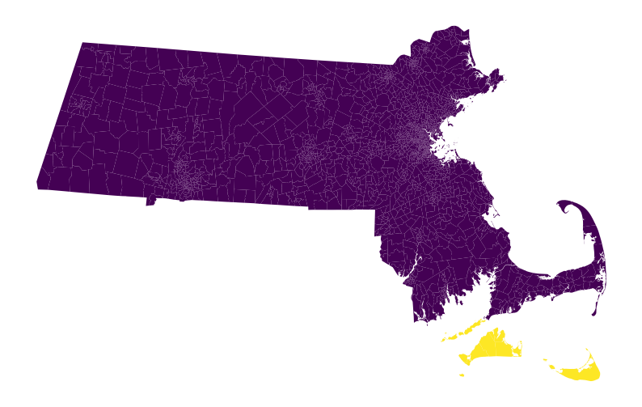
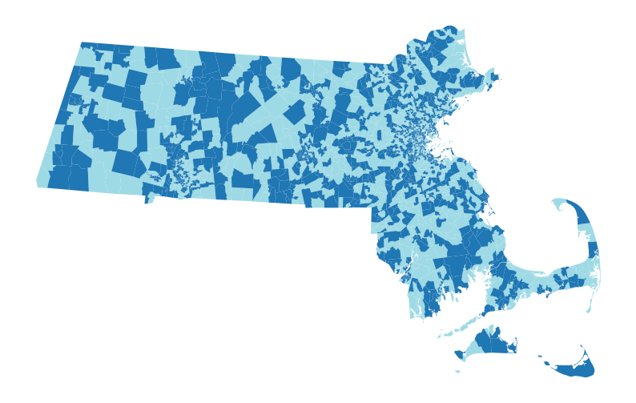

What to do about islands and connectivity
=========================================

When you create or load a graph, you may have see a warning about
islands, like this one for Massachusetts's 2016 voting precincts. First
we download the shapefile into a GeoDataFrame called “precincts_df” and
then build the Graph object “precincts_graph” from the GeoDataFrame.

.. code:: python

   >>> from gerrychain import Graph
   >>> import geopandas# # 
   >>> precincts_df = geopandas.read_file("https://github.com/mggg-states/MA-shapefiles/raw/master/MA_precincts_12_16.zip")
   >>> precincts_graph = Graph.from_geodataframe(precincts_df)
   graph.py:388: UserWarning: Found islands (degree-0 nodes). Indices of islands: {836, 1278}
     warnings.warn(

This warning is telling you that there are a couple of nodes (836, 1278)
that have no neighbors—that is, they are completely disconnected from
the rest of the graph. In addition to these nodes without neighbors, we
can also have a whole cluster of nodes that is disconnected from the
rest of the graph.

These are a problem because we want the districting plans we generate to
have contiguous districts, and any district with one of these islands
will not be contiguous. In addition, spanning tree-based methods like
the ReCom proposal or the ``recursive_tree_part`` seed-creation method
require that the graph be connected—starting with a disconnected graph
can lead to mysterious ``KeyError``\ s and infinite loops.

These islands and disconnected components show up when there are actual
geographic islands, or (for example) when there is a unit that is
connected to the mainland by a bridge but whose official boundary in the
shapefile does not touch the mainland's boundary. If we plot the
shapefile, we can see the problem:

.. code:: python

   >>> import matplotlib.pyplot as plt
   >>>
   >>> # Change the projection so we can plot it:
   >>> precincts_df.to_crs(precincts_df.estimate_utm_crs(), inplace=True)
   >>>
   >>> precincts_df.plot(figsize=(10, 10))
   >>> plt.axis('off')
   >>> plt.show()

This notebook will show you how to diagnose these contiguity problems,
and will give you a few different strategies for dealing with islands
and disconnected components so that you can get your graph to a workable
state for generating ensembles of districting plans.

Figuring out what is going on
-----------------------------

The first step in the process is to figure out what is going on. To see
the node IDs of the islands that GerryChain warned us about, we can
inspect ``precincts_graph.islands``:

.. code:: python

   >>> islands = precincts_graph.islands
   >>> islands
   {836, 1278}

GerryChain warns you when there are islands, but we'll also want to see
if there are whole disconnected components of the graph. We can use the
`NetworkX <https://networkx.github.io>`__ function
``connected_components`` to do this. The ``connected_components``
function yields the set of node indices in each connected component of
the graph. We'll put these sets into a list, and then print out their
lengths to see how bad the contiguity situation is:

.. code:: python

   >>> from networkx import is_connected, connected_components
   >>> components = list(connected_components(precincts_graph))
   >>> [len(c) for c in components]
   [2143, 6, 1, 1]

We have one big component with 2143 nodes. The two components with 1
node are the islands that GerryChain warned us about. Then we also have
another disconnected component with 6 nodes.

To fix these problems, we have two options. The first strategy is to
just delete these disconnected components, and do our analysis on the
big connected component. This might be the right way to go if you are
just trying to get started—you can always go back and make a better fix
later when you want to make sure your results are sound.

The second strategy is to manually add edges to the graph to connect all
of the disconnected components. This is more involved but will give you
a much better graph for your analysis.

Strategy 1: Delete the problem components
-----------------------------------------

For the quick and very dirty route, we can just delete all of the nodes
in components that are causing us problems:

.. code:: python

   >>> biggest_component_size = max(len(c) for c in components)
   >>> problem_components = [c for c in components if len(c) != biggest_component_size]
   >>> for component in problem_components:
   ...     for node in component:
   ...         precincts_graph.remove_node(node)

We can verify that our graph is now connected:

.. code:: python

   >>> is_connected(precincts_graph)
   True

And now we're ready to run a chain! Let's save the graph in a new
``.json`` file so that we don't have to do this fix every time we want
to run a chain.

.. code:: python

   >>> precincts_graph.to_json("./my_graph_with_islands_deleted.json")

Strategy 2: Connect the components manually
-------------------------------------------

Deleting the problem components will make it easier for your code to
run, but we should not use this method when we actually care about the
results we are getting. Deleting nodes from the graph also deletes all
the people who live in those nodes, which is strictly not OK, morally
speaking. For a better, more laborious solution, we will:

-  Use QGIS to open the shapefile that our graph was made from
-  Examine the disconnected components in QGIS, and
-  Judiciously add edges to the graph to make it connected.

This requires making some human judgements about which units are “near”
to each other, for the purposes of district contiguity. This is an art
more than a science, with a lot of questions with no single right
answer. For instance, should all of the Hawaiian islands be connected to
one another, or connected in a chain from east to west? Should the upper
peninsula of Michigan connect to the lower pensinsula only at the
Mackinac bridge, or all along the coast?

Inspecting the disconnected components
~~~~~~~~~~~~~~~~~~~~~~~~~~~~~~~~~~~~~~

The next step in the process is to open the precinct shapefile in QGIS
so we can see what's going on. Here is the precinct map again:

.. code:: python

   >>> precincts_df.plot(figsize=(10, 10))
   >>> plt.axis('off')
   >>> plt.show()

It's not immediately clear from this plot where the disconnected
components are. But we can use our adjacency graph to get the
identifiers (often located in a column called something like “GEOID”,
but in this example located in a column called “NAME”) of the
disconnected nodes, which we can then highlight using QGIS (or
geopandas).

First we'll collect the NAMEs of all of the nodes and use them to
highlight the precincts that we need to connect.

.. code:: python

   >>> components = list(connected_components(precincts_graph))
   >>> [len(c) for c in components]
   [2143, 6, 1, 1]
   >>> biggest_component_size = max(len(c) for c in components)
   >>> problem_components = [c for c in components if len(c) != biggest_component_size]
   >>> problem_nodes = [node for component in problem_components for node in component]
   >>> problem_ids = [precincts_graph.nodes[node]["NAME"] for node in problem_nodes]
   >>> problem_ids
   ['Edgartown Town Precinct 1',
    'Chilmark Town Precinct 1',
    'Oak Bluffs Town Precinct 1',
    'Tisbury Town Precinct 1',
    'Aquinnah Town Precinct 1',
    'West Tisbury Town Precinct 1',
    'Gosnold Town Precinct 1',
    'Nantucket Precinct 1']
   >>> is_a_problem = precincts_df["NAME"].isin(problem_ids)
   >>> precincts_df.plot(column=is_a_problem, figsize=(10, 10), cmap='viridis')
   >>> plt.axis('off')
   >>> plt.show()

We can do the same thing in QGIS by using the “Select by Expression”
feature with an expression like this:

::

   "NAME" in (
    'Edgartown Town Precinct 1',
    'Chilmark Town Precinct 1',
    'Oak Bluffs Town Precinct 1',
    'Tisbury Town Precinct 1',
    'Aquinnah Town Precinct 1',
    'West Tisbury Town Precinct 1',
    'Gosnold Town Precinct 1',
    'Nantucket Precinct 1'
   )

where we've copied and pasted the NAMEs from our ``problem_ids``
variable into the ``...`` part between the parentheses.

Then click “Select features” and you should see these same features
highlighted on the map.

Adding edges to the graph
~~~~~~~~~~~~~~~~~~~~~~~~~

Now comes the fun part! We want to identify some edges that we can add
to make the graph connected. To do this, we want to:

-  Zoom into the areas where these disconnected precincts (highlighted
   in yellow) are close to block groups in the main connected component
   (in purple)
-  Use the “Identify features” tool to inspect the attributes of the
   yellow and purple block groups that we want to connect
-  Copy the ``"NAME"`` attribute values for both of the units we want to
   connect

Once we have these GEOIDs, we can find the corresponding nodes in the
graph and add that edge. For the Massachusetts example, here are two
GEOIDs of nodes that I want to connect that I found in QGIS:

.. code:: python

   >>> purple_nameid = "Falmouth Town Precinct 1"
   >>> yellow_nameid = "Gosnold Town Precinct 1"

Next, we find the corresponding node using this NAME. Let's write a
function to do this to save some mental space:

.. code:: python

   >>> def find_node_by_nameid(nameid, graph=precincts_graph):
   >>>     for node in graph:
   ...         if graph.nodes[node]["NAME"] == nameid:
   ...             return node

.. code:: python

   >>> purple_node = find_node_by_nameid(purple_nameid)
   >>> yellow_node = find_node_by_nameid(yellow_nameid)
   >>> purple_node, yellow_node
   (755, 836)

And now we can finally add the edge ``(755, 836)`` to connect these
nodes:

.. code:: python

   >>> precincts_graph.add_edge(purple_node, yellow_node)

Let's use ``connected_components`` to see if we've made our graph more
connected.

.. code:: python

   >>> [len(c) for c in connected_components(precincts_graph)]
   [2144, 6, 1]

Yay! We've connected one of the islands that GerryChain warned us about.
Now we'll repeat this process of adding edges until the graph only has
one connected component.

Here are the remaining pairs of NAMEs that I found that I wanted to
connect:

.. code:: python

   >>> nameids_i_found = [
   ...     ("Nantucket Precinct 1", "Edgartown Town Precinct 1"),
   ...     ("Aquinnah Town Precinct 1", "Gosnold Town Precinct 1")
   ... ]

Let's add them:

.. code:: python

   >>> edges_to_add = [(find_node_by_nameid(u), find_node_by_nameid(v)) for u, v in nameids_i_found]
   >>> for u, v in edges_to_add:
   ...     precincts_graph.add_edge(u, v)

And let's verify that the graph is connected:

.. code:: python

   >>> assert len(list(connected_components(precincts_graph))) == 1
   >>> is_connected(precincts_graph)
   True

Hooray! 🎉🎉🎉 The graph is connected now! 🎉🎉🎉

Now we can run a proper Markov chain, without deleting any people from
the graph.

Discontiguous plans
-------------------

In addition to connectivity problems in the actual graph, you may also
need to think about discontiguities in districting plans. That is, if we
want to use a real-life plan as our initial state in GerryChain, we will
want it to be contiguous, so we need to make sure that our graph
structure has the right edges in place for that to be true.

The process for fixing discontiguous plans is similar to the above
process. The only difference is in how we identify the problematic
nodes. GerryChain provides a function ``contiguous_components`` that
takes a Partition and returns the contiguous components of each
district.

Here's how we can find those components, using a random example plan
with 2 districts for Massachusetts, just to see what a (very!)
discontiguous plan looks like:

.. code:: python

   >>> from gerrychain.constraints.contiguity import contiguous_components, contiguous
   >>> from gerrychain import Partition
   >>> import random
   >>> random.seed(0)
   >>> assignment = {}
   >>> for node in precincts_graph:
   ...    if random.random() < 0.5:
   ...        assignment[node] = 0
   ...    else:
   ...        assignment[node] = 1
   >>> discontiguous_plan = Partition(precincts_graph, assignment)

Now we'll verify that the plan does not pass our contiguity test, and
examine the two contiguous components:

.. code:: python

   >>> contiguous(discontiguous_plan)
   False
   >>> for key in contiguous_components(discontiguous_plan).keys():
   ...    print(key, len(contiguous_components(discontiguous_plan)[key]))
   0 90
   1 97
   >>> discontiguous_plan.plot(precincts_df, figsize=(10, 10), cmap="tab20")
   >>> plt.axis('off')
   >>> plt.show()

For any district with more than one contiguous component, you'll want to
do the exact same process that we did with the overall graph above: add
edges until there is only one contiguous component.

If the starting plan is not important to you, then you might want to use
a function like ``recursive_tree_part`` to generate a starting plan from
scratch.
