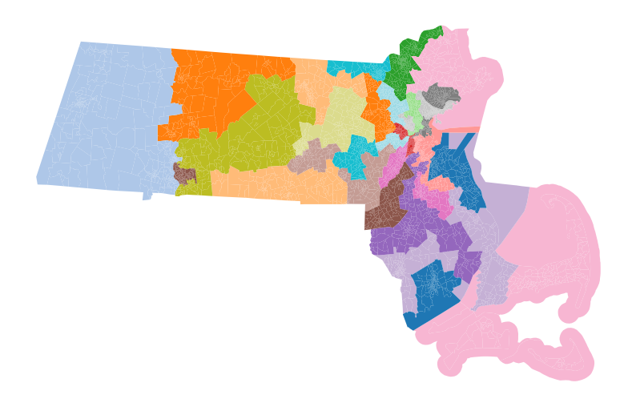

Using ``maup`` to import a real-life plan in GerryChain
=======================================================

To generate an ensemble of districting plans using GerryChain, we need a
starting point for our Markov chain. GerryChain gives you functions like
``recursive_tree_part`` to generate such plans from scratch, but you may
want to use an actual districting plan from the real world instead. You
also may want to compare a real-life plan to your ensemble.

`MAUP <https://github.com/mggg/maup>`_ is MGGG's package for doing
common spatial data operations with redistricting data. We'll use this
package to assign our basic geographic units to the districts in the
plan we're interested in. Our steps are:

-  Download shapefiles of the districting plan we're interested in and
   the basic units that we want to use,
-  Use ``maup`` to assign the basic units to the districts in that plan,
   and then
-  Create a GerryChain Partition using that assignment.

.. code:: python

   >>> import maup
   >>> import geopandas
   >>> import matplotlib.pyplot as plt

Downloading shapefiles
----------------------

For this guide, we'll assign Massachusetts's 2020 block groups to the
2022 Massachusetts State Senate districting plan. We can use
`geopandas <https://geopandas.org>`__ to download the shapefiles that we
need straight from the TIGER/Line files on the U.S. Census Bureau's
website and load them into Python as GeoDataFrames:

.. code:: python

   >>> districts = geopandas.read_file("https://www2.census.gov/geo/tiger/TIGER2022/SLDU/tl_2022_25_sldu.zip")
   >>> units = geopandas.read_file("https://www2.census.gov/geo/tiger/TIGER2022/BG/tl_2022_25_bg.zip")

.. note::
   
   These shapefiles and the GeoDataFrames that we have
   created from them contain only basic information about the geographies
   of the underlying units. It is often important to incorporate additional
   information about population, election data, etc. See 
   `this page <../user/getting_started.html>`_ for more info.

Getting the assignment
----------------------

Now we can use ``maup`` to assign our units to districts.

.. code:: python

   >>> assignment = maup.assign(units, districts)

Note that this produces a warning message something like the following:

.. code:: python

   ---------------------------------------------------------------------------

   Geometry is in a geographic CRS. Results from 'area' are likely incorrect. Use 'GeoSeries.to_crs()' to re-project geometries to a projected CRS before this operation.

     df = df[df.area > area_cutoff].reset_index(drop=True)
   UserWarning: Geometry is in a geographic CRS. Results from 'area' are likely incorrect. Use 'GeoSeries.to_crs()' to re-project geometries to a projected CRS before this operation.

     geometries = geometries[geometries.area > area_cutoff]
   Geometry is in a geographic CRS. Results from 'area' are likely incorrect. Use 'GeoSeries.to_crs()' to re-project geometries to a projected CRS before this operation.

     return assign_to_max(intersections(sources, targets, area_cutoff=0).area)

This is because shapefiles from the Census Bureau all use a “geographic”
coordinate projection, using latitude/longitude coordinates to represent
the locations of points. These coordinates are too coarse for many
geometric operations (e.g., accurate computations of lengths and areas),
so it is recommended (but not required!) to convert to a
“non-geographic” coordinate projection better suited for such
computations. One option is to reproject to a suitable UTM (Universal
Transverse Mercator) projection via

.. code:: python

   >>> districts.to_crs(districts.estimate_utm_crs(), inplace=True)
   >>> units.to_crs(units.estimate_utm_crs()), inplace=True)

Now let's repeat the ``maup.assign`` command:

.. code:: python

   >>> assignment = maup.assign(units, districts)

And now it runs without producing the warning message! 🎉

We'll save the assignment in a column of our ``units`` GeoDataFrame:

.. code:: python

   >>> units["SENDIST"] = assignment

Let's use the `pandas <http://pandas.pydata.org/>`__ ``.isna()`` method
to see if we have any units that could not be assigned to districts:

.. code:: python

   >>> assignment.isna().sum()
   0

This means that every unit was successfully assigned. If our basic units
were too large to get a meaningful assignment, or if the districts did
not cover all of our units (e.g. if our units included parts of the
Atlantic Ocean but the districts did not), then we would have units with
NA assignments that we would need to make decisions about.

Creating a ``Partition`` with the real-life assignment
------------------------------------------------------

Now we are ready to use this assignment in GerryChain. We'll start by
building the GerryChain Graph object that records adjacency information
between our basic units

.. code:: python

   >>> from gerrychain import Graph, Partition
   >>> graph = Graph.from_geodataframe(units)

For larger GeoDataFrames, building this Graph object can take awhile!
Once you have built it, you may want to save it as a .json file:

.. code:: python

   >>> graph.to_json("./BG_graph.json")

Then you can read it in again later using:

.. code:: python

   >>> graph = Graph.from_json("./BG_graph.json")

Each node of this graph represents one basic unit, and the node contains
all the information about that unit that was contained in the
GeoDataFrame for the units. For example, here is the first node in the
graph:

.. code:: python

   >>> graph.nodes[0]
   {'boundary_node': False,
    'area': 1054008.1312115968,
    'STATEFP': '25',
    'COUNTYFP': '027',
    'TRACTCE': '728200',
    'BLKGRPCE': '3',
    'GEOID': '250277282003',
    'NAMELSAD': 'Block Group 3',
    'MTFCC': 'G5030',
    'FUNCSTAT': 'S',
    'ALAND': 1053449,
    'AWATER': 0,
    'INTPTLAT': '+42.3265093',
    'INTPTLON': '-071.8222284',
    'SENDIST': 33}

.. note:: 
   If we happened to have a preexisting unit graph and we
   needed to add the district assignments to the nodes of the graph, we
   would need to match the nodes of our graph to the geometries in
   ``units`` by their GEOIDs. We could use the Graph object's ``.join()``
   method to do this matching automatically:

   .. code:: python

      >>> graph.join(units, columns=["SENDIST"], left_index="GEOID", right_index="GEOID")

   The ``left_index`` and ``right_index`` arguments tell the ``.join()``
   method to use the ``GEOID`` node attribute and the ``GEOID`` column of
   ``units`` to match the records in ``units`` to the nodes of our
   graph.

Now we use the Graph node attribute called ``SENDIST`` to create a
Partition:

.. code:: python

   >>> real_life_plan = Partition(graph, "SENDIST")

To check our work, let's plot the ``real_life_plan`` on the units using
the Partition's ``.plot()`` method:

.. code:: python

   >>> real_life_plan.plot(units, figsize=(10, 10), cmap="tab20")
   >>> plt.axis('off')
   >>> plt.show()

That looks like a districting plan! Woohoo! 🎉🎉🎉

Troubleshooting possible issues
~~~~~~~~~~~~~~~~~~~~~~~~~~~~~~~

If the plan looked like random noise or confetti, then we might suspect
that something had gone wrong. The two places we would want to look for
problems would be:

-  the ``graph.join`` call, which would go wrong if the GEOIDs did not
   match up correctly, or
-  the final ``real_life_plan.plot`` call, which would go wrong if the
   GeoDataFrame's index did not match the node IDs of our graph in the
   right way.

We could inspect both issues by making sure that the records with
matching IDs actually referred to the same block groups.

You also might run into problems when you go to run a Markov chain using
the partition we made. If the districts are not contiguous with respect
to your underlying graph, you would need to add edges (within reason) to
make the graph agree with the notion of contiguity that the real-life
plan uses. See `What to do about islands and
connectivity <https://github.com/mggg/maup/wiki/What-to-do-about-islands-and-connectivity>`__
for a guide to handling those types of issues.
